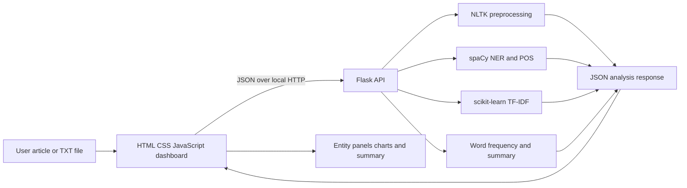

# AI News Intelligence

A college mini project that analyzes a pasted or uploaded news article with traditional NLP techniques. The Flask backend returns named entities, TF-IDF keywords, word counts, POS tags, preprocessing output, article statistics, and an extractive summary. The vanilla JavaScript dashboard displays those results and highlights entities in the source article.

## Problem statement

News articles contain many names, organizations, places, dates, and figures. Finding these details by reading each article manually takes time. This project demonstrates how NLP can turn unstructured article text into structured information that is easier to scan.

## Objectives

- Build a responsive browser dashboard with HTML, CSS, and vanilla JavaScript.
- Accept pasted news text and plain `.txt` files.
- Apply tokenization, lowercasing, punctuation removal, and stopword filtering.
- Extract people, organizations, locations, dates, and money values with spaCy NER.
- Rank terms with sentence-level TF-IDF and calculate content-word frequencies.
- Tag parts of speech and generate an extractive summary.
- Present the results and processing stages in a clear dashboard.

## Features

- Paste an article, load the built-in demo, or select a `.txt` file.
- Enforce a 50,000-character article limit and a 1 MB file limit.
- Display article statistics, entity groups, TF-IDF keywords, POS tags, preprocessing output, and summary.
- Highlight recognized entities in the original article.
- Plot content-word counts in a Chart.js horizontal bar chart.
- Return readable validation, server, network, and NLP setup errors.
- Keep the application stateless: article text is processed in memory and is not saved to a database.

## Project structure

```text
NLP_Project/
├── .gitignore
├── README.md
├── .vscode/
│   └── extensions.json
├── frontend/
│   ├── index.html
│   ├── style.css
│   └── script.js
└── backend/
    ├── app.py
    ├── requirements.txt
    ├── setup_nlp.py
    ├── sample_news.txt
    ├── services/
    │   ├── __init__.py
    │   ├── keywords.py
    │   ├── ner.py
    │   ├── pos_tagger.py
    │   ├── preprocessing.py
    │   ├── spacy_model.py
    │   ├── statistics.py
    │   └── summarizer.py
    └── tests/
        ├── __init__.py
        └── test_analysis.py
```

## Requirements

- Python 3.10 or newer
- Internet access for Python package/model downloads and the Chart.js CDN
- VS Code is recommended, but not required

The interface uses plain HTML5, CSS3, and JavaScript. The backend uses Flask, Flask-CORS, spaCy, NLTK, scikit-learn, pandas, and NumPy. Charts use Chart.js from jsDelivr. No React, Node.js, database, or frontend framework is used.

## Installation

Open PowerShell at the project root and create the backend virtual environment:

```powershell
cd backend
py -m venv .venv
.\.venv\Scripts\Activate.ps1
python -m pip install --upgrade pip
pip install -r requirements.txt
python setup_nlp.py
```

`setup_nlp.py` downloads the `en_core_web_sm` spaCy model and the NLTK tokenizer and stopword data. It is safe to run again if a resource needs to be repaired. If PowerShell blocks virtual-environment activation, run the environment's Python directly from `backend`:

```powershell
.\.venv\Scripts\python.exe app.py
```

## How to run

Start the backend in a terminal from the `backend` folder, with its virtual environment active:

```powershell
python app.py
```

In a second terminal, from the project root, serve the frontend:

```powershell
python -m http.server 8000 --directory frontend
```

Open <http://127.0.0.1:8000>, select **Load demo article**, then **Analyze article**. The dashboard sends the text to the local Flask service at `http://127.0.0.1:5000`.

## NLP methodology

1. **Input validation:** the API checks JSON content, non-empty text, and the 50,000-character limit.
2. **Cleaning:** HTML entities and tags and URLs are removed; text is lowercased and whitespace is normalized.
3. **Tokenization and filtering:** NLTK tokenizes the text. Punctuation and numeric-only tokens are left out of the processed content-word stream, and English stopwords are removed.
4. **POS tagging:** spaCy assigns universal POS categories and fine-grained English tags to the original article tokens.
5. **Named entity recognition:** spaCy's `en_core_web_sm` model identifies supported people, organizations, places, dates, and monetary values. The service retains character offsets for highlighting.
6. **Keyword ranking:** each sentence is treated as a document for scikit-learn TF-IDF. Sentence-level units give IDF useful variation within a single article. Unigrams and bigrams are considered.
7. **Word frequency:** the backend counts preprocessed, stopword-filtered content words and returns the most frequent terms.
8. **Extractive summary:** sentences are scored by their article-specific content-word frequencies. The highest-scoring sentences are returned in their original order; no new sentences are generated.
9. **Display:** the frontend renders only values returned by the Python API. It uses text nodes for article and entity text.

### System architecture



## API documentation

### `GET /api/health`

Returns a small health response:

```json
{"status": "ok", "service": "ai-news-intelligence"}
```

### `POST /api/analyze`

Send JSON with a `text` string:

```json
{"text": "NASA announced a climate mission in New Delhi on Tuesday."}
```

The response contains `statistics`, `preprocessing`, `entities`, `keywords`, `word_frequency`, `pos`, and `summary`. Invalid content returns JSON errors with an appropriate HTTP status. Browser CORS is enabled for local development origins on ports 5500 and 8000.

## Example input and output

Input:

> NASA announced a climate mission in New Delhi on Tuesday. The agency will spend $85 million to launch two satellites next year.

The output contains Python-derived entity mentions such as NASA, New Delhi, Tuesday, and `$85 million`; ranked article keywords; content-word counts; POS tags; and selected source sentences. Exact model predictions and rankings can vary with library/model versions and input context.

## Screenshots

Add screenshots after running the dashboard locally:

```text


```

## Testing

From the `backend` folder, activate the virtual environment and run the built-in test suite:

```powershell
python -m unittest discover -s tests -v
```

The checks cover preprocessing, NER, TF-IDF, word frequency, POS tags, summarization, and API validation/response sections. The spaCy model and NLTK data must be installed first.

## Results

The application produces structured analysis from the actual article supplied by the user. The overview reports total and unique whitespace-delimited words, sentence count, entity occurrences, and returned keywords. Dedicated panels show grouped unique entity values, TF-IDF scores, frequent content terms, POS tags, the processed token stream, and selected sentences from the original article.

## Advantages

- Simple architecture suitable for a college mini project and viva.
- Shows several syllabus-level NLP techniques in one interface.
- Uses real NLP library outputs rather than hard-coded analysis results.
- Does not require a database or external AI service.
- Highlights entity mentions in context and includes readable results for inspection.

## Limitations

- `en_core_web_sm` is a general English model; it can miss entities, confuse labels, or perform poorly on unfamiliar names and noisy text.
- TF-IDF and frequency-based summarization are statistical baselines. They do not understand meaning as deeply as a trained abstractive model.
- Sentence-level TF-IDF uses only the current article as its document collection; keyword scores are article-relative.
- Numeric-only tokens are excluded from the processed content-word stream, though original text is still used for NER, POS tagging, and display.
- The app handles English text, has no persistent history, and requires the Python backend to be running locally.
- The chart requires an internet connection to load Chart.js from jsDelivr.

## Future improvements

- Add support for more languages and domain-specific entity models.
- Add a user-selectable summary length and compare multiple extractive scoring methods.
- Improve the local model with a labeled news corpus and evaluate entity precision and recall.
- Add optional export to JSON or PDF and a comparison view for multiple articles.
- Bundle the chart library locally for offline use.
- Add a deployment configuration and stronger production security settings.

## Conclusion

AI News Intelligence demonstrates a complete traditional NLP workflow in a small web application. It combines preprocessing, tokenization, stopword filtering, POS tagging, named entity recognition, TF-IDF, word frequency, and extractive summarization, then presents the results in a responsive dashboard. Its outputs are useful for demonstration and learning, while its limitations make clear where statistical NLP can be improved.

## Viva Questions

1. **What is NLP?** — Natural Language Processing is a field of computing that helps software work with human language.
2. **What is tokenization?** — Tokenization splits text into smaller units, such as words or sentences.
3. **Why do we remove stopwords?** — Common words such as “the” and “is” often add little value to keyword and frequency analysis, so removing them helps focus on content words.
4. **What is stemming?** — Stemming removes word endings using simple rules, sometimes producing a root that is not a valid dictionary word. This project does not apply stemming.
5. **What is lemmatization?** — Lemmatization maps a word to its dictionary base form using linguistic information. This project does not currently apply a separate lemmatization step.
6. **What is POS tagging?** — Part-of-speech tagging labels words by grammatical role, such as noun, verb, adjective, or preposition.
7. **What is NER?** — Named Entity Recognition finds named items in text, such as people, organizations, places, dates, and money values.
8. **Why is spaCy used?** — spaCy provides a trained English pipeline for entity recognition and grammatical tagging, with token offsets that support highlighting.
9. **What is TF-IDF?** — Term Frequency–Inverse Document Frequency scores terms by how often they occur in a document and how rare they are across a document collection.
10. **Why can TF-IDF be better than simple word frequency?** — Frequency only measures repetition. TF-IDF also reduces the influence of terms that appear in many documents. Here, article sentences act as the document collection.
11. **What is extractive summarization?** — It builds a summary by selecting existing sentences from the source instead of generating new wording.
12. **How does this summarizer work?** — It counts content words in the article, scores each sentence by those word frequencies, selects the top sentences, then restores their original order.
13. **Why is there no database?** — The project analyzes one submitted article at a time and returns results immediately. It does not need persistent storage for its current scope.
14. **Why is Flask used?** — Flask is a small Python web framework that exposes the NLP services through a simple HTTP API.
15. **What are the limitations of the project?** — The model can miss or misclassify entities, the summary and keywords are statistical, only English is supported, and the app does not save article history.
